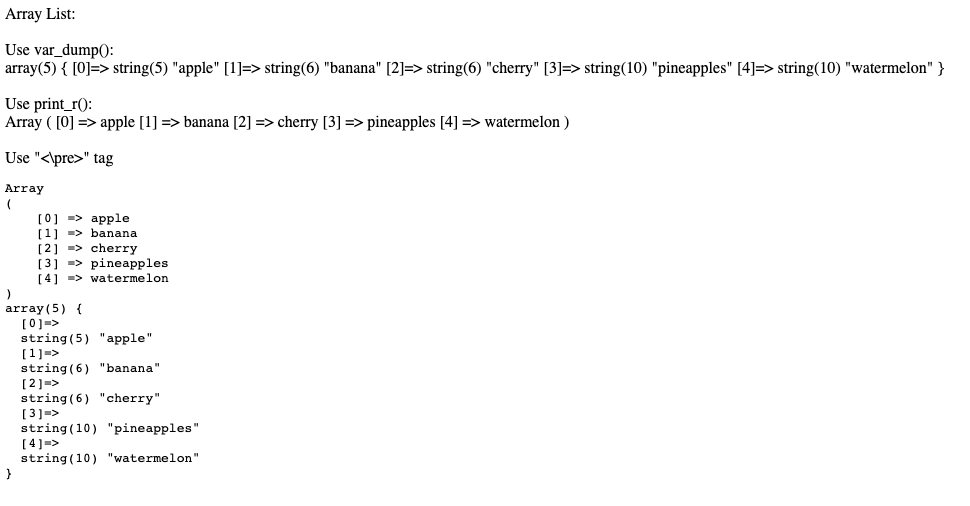

## 1. Mảng - Array
Trong PHP , Array là một kiểu cấu trúc dữ liệu cho phép ta lưu trữ nhiều phần từ có kiểu dữ liệu tương tự dưới
một biến duy nhất, do đó giúp chúng ta tiết kiệm được nhiều công sức tạo một biến khác cho mỗi dữ liệu.

Có thể truy cập vào mảng bằng chỉ mục `index` và `keys` trong mảng đó.

- Về cơ bản có 3 loại mảng trong PHP
    * Indexed hay Numeric Array:
    * Associate Arrays:
    * Multidimensional Arrays:

#### 1. Indexed or Numeric Arrays:
Là loại mảng có thể được sử dụng để lưu trữ bất kỳ loại pần tử nào, nhưng chỉ mục luôn luôn là số (number).
Theo mặc định, các `index` bắt đầu từ con số 0. Các mảng này được tạo theo 2 cách khác nhau:
```php
<?php
// One way to create an indexed array
$name_one = array("AAA", "BBB", "CCC", "DDD", "EEE");

// Accessing the elements directly
echo "Accessing the 1st array elements directly:\n";
echo $name_one[2], "\n";
echo $name_one[0], "\n";
echo $name_one[4], "\n";

// Second way to create an indexed array
$name_two[0] = "ZAc";
$name_two[1] = "ANT";
$name_two[2] = "RAM";
$name_two[3] = "SAL";
$name_two[4] = "RAG";

// Accessing the elements directly
echo "Accessing the 2nd array elements directly:\n";
echo $name_two[2], "\n";
echo $name_two[0], "\n";
echo $name_two[4], "\n";

?>
```

#### 2. Associate Arrays:
Các mảng này tương tự như các mảng được lập chỉ mục nhưng thay vì lưu trữ tuyến tính (linear storage), mọi giá trị có thể được gán bằng khoá do người dùng xác định (user-defined)
bằng khoá do người dùng xác định thuộc loại chuỗi.

```php
<?php
// One way to create an associative array
$name_one = array("Zack"=>"Zara", "Anthony"=>"Any", 
				"Ram"=>"Rani", "Salim"=>"Sara", 
				"Raghav"=>"Ravina");

// Second way to create an associative array
$name_two["zack"] = "zara";
$name_two["anthony"] = "any";
$name_two["ram"] = "rani";
$name_two["salim"] = "sara";
$name_two["raghav"] = "ravina";

// Accessing the elements directly
echo "Accessing the elements directly:\n";
echo $name_two["zack"], "\n";
echo $name_two["salim"], "\n";
echo $name_two["anthony"], "\n";
echo $name_one["Ram"], "\n";
echo $name_one["Raghav"], "\n";

?>
```
#### 3. Multidimensional Arrays:
Mảng đa chiều là những mảng lưu trữ một mảng khác ở mỗi chỉ mục thay vì một phần tử đơn lẽ. Nói cách khác, chúng ta định nghĩa mảng
đa chiều là một màng của các mảng.

Như mọi phần tử trong mảng này có thể là một mảng chứa các mảng con khác bên trong. Mảng hoặc mảng con trong mảng đa chiều có thể được
truy cập nhiều chiều khác nhau.

```php
<?php
// Defining a multidimensional array
$favorites = array(
	array(
		"name" => "Dave Punk",
		"mob" => "5689741523",
		"email" => "davepunk@gmail.com",
	),
	array(
		"name" => "Monty Smith",
		"mob" => "2584369721",
		"email" => "montysmith@gmail.com",
	),
	array(
		"name" => "John Flinch",
		"mob" => "9875147536",
		"email" => "johnflinch@gmail.com",
	)
);

// Accessing elements
echo "Dave Punk email-id is: " . $favorites[0]["email"], "\n";
echo "John Flinch mobile number is: " . $favorites[2]["mob"];

?>
```

```php
Id email của Dave Punk là: davepunk@gmail.com
Số điện thoại di động của John Flinch là: 9875147536
```

### Tạo ra một Array
#### 1. `array()` function
`array()` là một hàm có sẵn trong PHP, được sử dụng để tạo một mảng.
Có 3 loại mảng được tạo bằng func() `array()`:


**Indexed array:** Các khóa của Indexed Array là các số nguyên bắt đầu từ 0
```php
//Syntax:
 array( val1, val2, val3, ... )
```

**Associative array**: Các khóa của mảng kết hợp là các chuỗi. Và bạn sử dụng mảng kết hợp khi bạn muốn truy cập các phần tử bằng các phím chuỗi.

```php
Syntax:
array( key=>val, key=>val, key=>value, ... )
```

Multidimensional array:
```php
array( array( val11, val12, ...)
           array( val21, val22, ...)
           ... )
```
> Cú pháp:
```php
<?php

$empty_array = array();
```

#### 2. Sử dụng `JSON notation []`.
* Dấu [] - Curly Brace - còn được gọi là JSON Notation
```php
<?php
$empty_array = [];
```

### Xuất một mảng ra màn hình
Có 2 cách để xuất một mảng ra khỏi màn hình
- `var_dump()`: Cung cấp đầy đủ chi tiết hơn về các biến hoặc cấu trúc dữ liệu, bao gồm kiểu dữ liệu, độ dài, giá trị và các thành phần (nếu là mảng hoặc đối tượng).
- `print_r()`: Cung cấp một bảng tóm tắt dễ đọc hơn về biến hoặc cấu trúc dữ liệu. Nó bao gồm các kiểu dữ liệu và chi tiết độ dài.
> Code ví dụ: [ArrayDemo.php](../C02_ControlStatement/ArrayDemo.php)
> 
```php
$data = array('apple', 'banana', 'cherry');
var_dump($data);
print_r($data);
```
```php
array(3) {
  [0]=>
  string(5) "apple"
  [1]=>
  string(6) "banana"
  [2]=>
  string(6) "cherry"
}
Array
(
    [0] => apple
    [1] => banana
    [2] => cherry
)
```
- Sử dụng `<pre></pre>` để code đẹp hơn
```php
<!DOCTYPE html>
<html lang="en">
<head>
    <meta charset="UTF-8">
    <title>Array Demo</title>
</head>
<body>
  <?php
    $data = array('apple', 'banana', 'cherry', 'pineapples', 'watermelon');
    echo "<pre>";
    print_r($data);
    var_dump($data);
    echo "</pre>";
  ?>
</body>
</html>
```

### Lấy độ dài mảng
`count()` function dùng để lấy độ dài của mảng:
```php
<?php
$scores = [1, 2, 3, 4, 5];
echo count($scores);
```
```php
5
```


## 2.  PHP Array `sort()` function:
* Trong PHP các function `sort()` được cung cấp để giúp ta sắp xếp dữ liệu trong `array` theo nhiều cách khác nhau.
* Trong đó:
    * `sort()` và `rsort()`: Sắp xếp mảng `Indexed arrays ` theo thứ tự tăng dần và giảm dần tương ứng.
    * `asort()` và `arsort()`: Sắp xếp mảng `Associative` theo _giá trị_ - `values` - tăng dần và giảm dần.
    * `ksort()` và `krsort()`: Sắp xếp mảng `Associative` theo _khóa_ - `key` -  tăng dần và giảm dần.

Bảng sau đây mô tả các hàm sắp xếp (sort functions) trong PHP và mô tả vấn đề mà chúng giải quyết:

|    Hàm     | Mô tả                                                                         |
|:----------:|-------------------------------------------------------------------------------|
|  `sort()`  | Sắp xếp mảng `Indexed arrays ` theo thứ tự `tăng dần`.                        |
| `rsort()`  | Sắp xếp mảng `Indexed arrays ` theo thứ tự `giảm dần`.                        |
| `asort()`  | Sắp xếp `Associative` theo thứ tự tăng dần dựa trên `values` của các phần tử. |
| `ksort()`  | Sắp xếp `Associative`theo thứ tự tăng dần dựa trên `key` của các phần tử.     |
| `arsort()` | Sắp xếp `Associative`theo thứ tự giảm dần dựa trên `values` của các phần tử.  |
| `krsort()` | Sắp xếp `Associative` theo thứ tự giảm dần dựa trên `key` của các phần tử.    |

* Các hàm sắp xếp trong PHP được sử dụng để sắp xếp các mảng theo các tiêu chí khác nhau, bao gồm giá trị và khóa của các phần tử. Điều này cho phép bạn tổ chức và truy cập dữ liệu một cách dễ dàng hơn trong các ứng dụng.
* Chẳng hạn, khi bạn muốn hiển thị dữ liệu theo thứ tự tăng dần hoặc giảm dần, bạn có thể sử dụng các hàm sắp xếp như `sort()`, `rsort()`, `asort()`, và `arsort()` tùy thuộc vào loại mảng bạn đang làm việc (mảng chỉ số hoặc mảng kết hợp).
* Các hàm `sort()`, `rsort()`, `ksort()`, và `krsort()` sắp xếp mảng trực tiếp, không tạo bản sao.
* Các hàm `asort()` và `arsort()` tạo bản sao của mảng, sau đó sắp xếp bản sao đó.
* Khi sử dụng `sort()` và `rsort()`, chỉ số của các phần tử sẽ bị thay đổi. Khi sử dụng các hàm còn lại, chỉ số của các phần tử vẫn được giữ nguyên.
* 